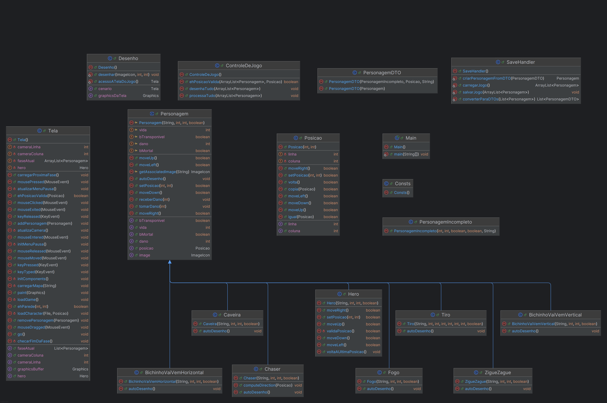

# Enter-The-Class
Um jogo desenvolvido usando Java e conceitos de POO para a disciplina SSC0504 do curso de Sistemas de Informação da USP.

Enter-The-Class é um jogo shooter em 2D desenvolvido em Java. O objetivo do jogador é eliminar todos os inimigos e destruir todas as mesas presentes no cenário de cada fase.

O jogo conta com 5 fases progressivamente mais desafiadoras. O personagem principal só consegue atirar em uma direção, exigindo posicionamento estratégico e movimentação cuidadosa.

Controles

    Setas do teclado – Movimentam o personagem

    Click Esquerdo – Atira

    S – Salva o estado atual do jogo

    L – Carrega o jogo salvo

    P – Pausa e retoma o jogo

### UML



## Comandos do Makefile

### `make build`
Compila todos os arquivos `.java` do diretório `src/` e gera os arquivos `.class` compilados no diretório `build/`.

```bash
make build
```

### `make run`

Compila o projeto e executa a classe principal (`Main`) usando os arquivos compilados de `build/`.

```bash
make run
```

### `make export`

Empacota todos os arquivos .class compilados em um único arquivo JAR chamado `Enter-The-Class.jar` no diretório `dist/`. Também define o ponto de entrada (`Main-Class`) para que o JAR possa ser executado diretamente.

```bash
make export
```
