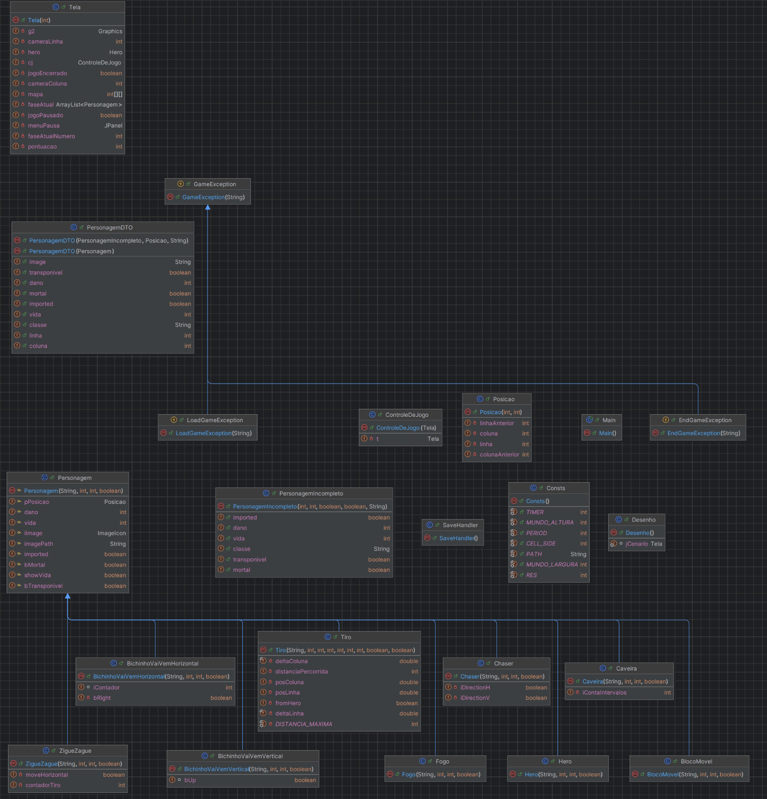

# Enter-The-Class
Um jogo desenvolvido usando Java e conceitos de POO para a disciplina SSC0504 do curso de Sistemas de Informação da USP.

### UML



## Comandos do Makefile

### `make build`
Compila todos os arquivos `.java` do diretório `src/` e gera os arquivos `.class` compilados no diretório `build/`.

```bash
make build
```

### `make run`

Compila o projeto e executa a classe principal (`Main`) usando os arquivos compilados de `build/`.

```bash
make run
```

### `make export`

Empacota todos os arquivos .class compilados em um único arquivo JAR chamado `Enter-The-Class.jar` no diretório `dist/`. Também define o ponto de entrada (`Main-Class`) para que o JAR possa ser executado diretamente.

```bash
make export
```
